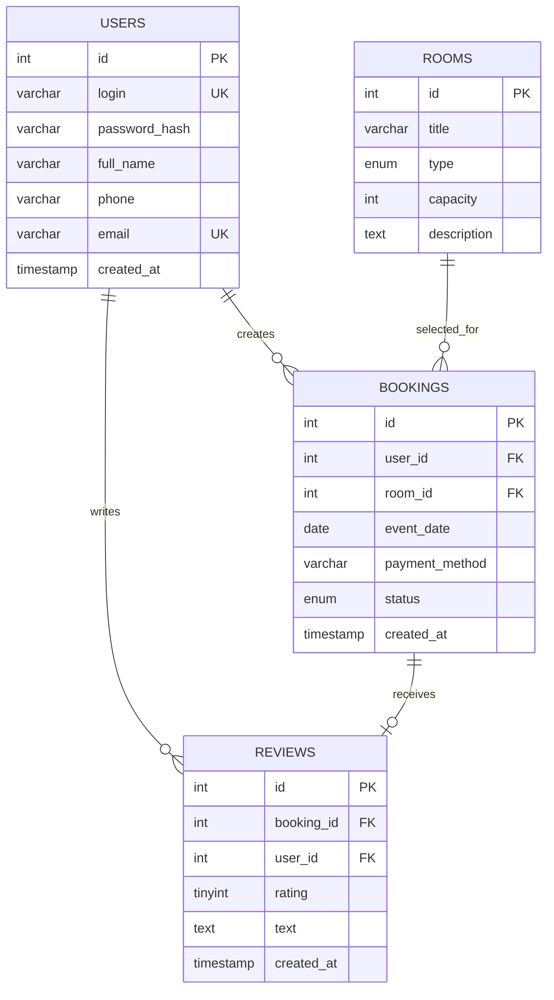

# ER-диаграмма

```mermaid
erDiagram
    USERS ||--o{ BOOKINGS : creates
    ROOMS ||--o{ BOOKINGS : selected_for
    USERS ||--o{ REVIEWS : writes
    BOOKINGS ||--o| REVIEWS : receives

    USERS {
        int id PK
        varchar login UK
        varchar password_hash
        varchar full_name
        varchar phone
        varchar email UK
        timestamp created_at
    }

    ROOMS {
        int id PK
        varchar title
        enum type
        int capacity
        text description
    }

    BOOKINGS {
        int id PK
        int user_id FK
        int room_id FK
        date event_date
        varchar payment_method
        enum status
        timestamp created_at
    }

    REVIEWS {
        int id PK
        int booking_id FK
        int user_id FK
        tinyint rating
        text text
        timestamp created_at
    }
```
